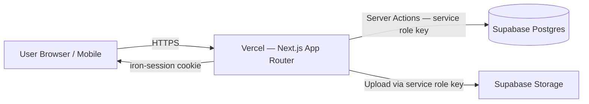
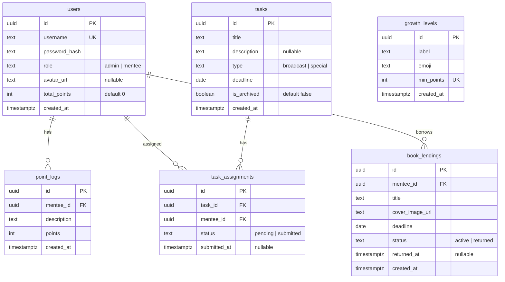

# 04 — Architecture

## High-Level Diagram



Catatan arsitektur:
- **Tidak ada Supabase Auth** — auth sepenuhnya manual (bcrypt + iron-session).
- **Tidak ada anon key di client** — semua query ke Supabase melalui service role key di server-side (Server Actions / Route Handlers).
- **Tidak ada RLS** — karena anon key tidak dipakai, proteksi akses lewat middleware + session check di Server Actions.
- **Tidak ada Realtime** — data refresh via `revalidatePath` / page reload.

## Runtime Boundary

Karena kita TIDAK pakai Supabase Auth dan anon key, boundary-nya lebih sederhana:

| Runtime | Bisa akses Supabase DB | Bisa akses session | Keterangan |
|---------|------------------------|--------------------|------------|
| Server Component | ✅ (service role) | ✅ (read cookie) | Fetch data untuk render halaman |
| Client Component | ❌ (tidak boleh) | ❌ (tidak langsung) | Hanya UI — panggil Server Action untuk mutasi |
| Server Action | ✅ (service role) | ✅ (read/write cookie) | Semua mutation lewat sini |
| Middleware | ❌ (jangan query DB) | ✅ (read cookie) | Hanya cek session untuk redirect |

**Prinsip utama:** Client Component TIDAK pernah bicara langsung ke Supabase. Semua lewat Server Action.

## Struktur Folder

```
berkembang/
├── app/
│   ├── login/
│   │   └── page.tsx                    # Login page (admin & mentee, satu form)
│   ├── admin/
│   │   ├── layout.tsx                  # Admin layout — sidebar/nav, session check role=admin
│   │   ├── dashboard/
│   │   │   └── page.tsx                # Admin overview — quick stats
│   │   ├── mentees/
│   │   │   ├── page.tsx                # Daftar mentee + tambah/hapus
│   │   │   └── [id]/
│   │   │       └── page.tsx            # Detail mentee — log poin, reset password
│   │   ├── tasks/
│   │   │   ├── page.tsx                # Daftar tugas aktif + arsip toggle
│   │   │   └── [id]/
│   │   │       └── page.tsx            # Detail tugas — centang per mentee
│   │   ├── books/
│   │   │   └── page.tsx                # Daftar peminjaman buku — aktif + arsip toggle
│   │   └── actions/
│   │       ├── auth.ts                 # Server Actions: login, logout, reset password
│   │       ├── mentees.ts              # Server Actions: CRUD mentee
│   │       ├── points.ts               # Server Actions: tambah/hapus log poin
│   │       ├── tasks.ts                # Server Actions: CRUD tugas, centang, archive
│   │       └── books.ts               # Server Actions: CRUD peminjaman buku
│   ├── mentee/
│   │   ├── layout.tsx                  # Mentee layout — bottom nav mobile, session check role=mentee
│   │   ├── leaderboard/
│   │   │   └── page.tsx                # Leaderboard — ranking semua mentee
│   │   ├── my-points/
│   │   │   └── page.tsx                # Detail log poin milik sendiri
│   │   ├── tasks/
│   │   │   └── page.tsx                # Daftar tugas (aktif + arsip tab)
│   │   ├── books/
│   │   │   └── page.tsx                # Daftar peminjaman buku (aktif + arsip tab)
│   │   ├── profile/
│   │   │   └── page.tsx                # Ganti password + upload foto profil
│   │   └── actions/
│   │       ├── profile.ts              # Server Actions: ganti password, upload foto
│   │       └── queries.ts              # Server Actions: fetch data untuk mentee views
│   ├── layout.tsx                      # Root layout — font, metadata
│   ├── page.tsx                        # Redirect ke /login
│   └── globals.css                     # Tailwind base + CSS variables
├── components/
│   ├── ui/                             # shadcn/ui primitives (Button, Card, Dialog, Input, Toast, etc.)
│   ├── auth/
│   │   └── login-form.tsx              # Client Component — form login
│   ├── leaderboard/
│   │   ├── leaderboard-card.tsx        # Card mentee di leaderboard
│   │   └── growth-badge.tsx            # Badge level pertumbuhan (Benih → Mekar Penuh)
│   ├── tasks/
│   │   ├── task-card.tsx               # Card tugas — regular vs rare visual
│   │   └── task-checklist.tsx          # Checklist mentee per tugas (admin view)
│   ├── books/
│   │   ├── book-card.tsx               # Card peminjaman buku
│   │   └── book-form.tsx               # Form tambah peminjaman
│   ├── points/
│   │   ├── point-log-list.tsx          # Daftar log poin
│   │   └── point-log-form.tsx          # Form tambah log poin
│   ├── shared/
│   │   ├── avatar.tsx                  # Avatar component (foto / inisial fallback)
│   │   ├── confirm-dialog.tsx          # Dialog konfirmasi generic
│   │   ├── empty-state.tsx             # Empty state generic
│   │   ├── image-upload.tsx            # Client Component — upload + kompresi gambar
│   │   └── page-header.tsx             # Header halaman consistent
│   └── nav/
│       ├── admin-sidebar.tsx           # Sidebar navigasi admin (desktop)
│       ├── admin-mobile-nav.tsx        # Bottom nav admin (mobile)
│       ├── mentee-bottom-nav.tsx       # Bottom nav mentee (mobile)
│       └── mentee-desktop-nav.tsx      # Top nav mentee (desktop)
├── lib/
│   ├── supabase/
│   │   └── admin.ts                    # Supabase client (service role key, server-only)
│   ├── auth/
│   │   ├── session.ts                  # iron-session config + helpers (getSession, saveSession, destroySession)
│   │   └── password.ts                 # bcrypt hash + compare helpers
│   ├── schemas/
│   │   ├── auth.ts                     # Zod: login, change password
│   │   ├── mentee.ts                   # Zod: create mentee
│   │   ├── point.ts                    # Zod: create point log
│   │   ├── task.ts                     # Zod: create task
│   │   └── book.ts                     # Zod: create book lending
│   ├── constants/
│   │   ├── growth-levels.ts            # Milestone poin → level pertumbuhan
│   │   └── routes.ts                   # Route constants
│   ├── utils.ts                        # cn(), formatDate(), formatPoints()
│   └── types.ts                        # Shared TypeScript types
├── middleware.ts                       # Route protection — cek session, redirect based on role
├── tailwind.config.ts
├── next.config.js
├── tsconfig.json                       # strict: true
├── .env.local                          # Secrets (gitignored)
└── .env.example                        # Template env vars
```

## Data Flow Patterns

### Read data di halaman (Server Component)

```
1. Browser request → Middleware cek session cookie
2. Session valid → Server Component render
3. Server Component panggil lib/supabase/admin.ts (service role client)
4. Query Supabase Postgres → data kembali
5. Render HTML → kirim ke browser
```

### Mutation (Server Action)

```
1. User klik tombol di Client Component
2. Client Component invoke Server Action (file actions/*.ts)
3. Server Action:
   a. Baca session (iron-session) → validasi role
   b. Validasi input (Zod schema)
   c. Query/mutation Supabase via service role client
   d. revalidatePath() route yang relevan
   e. Return { success, message } atau { error }
4. Client Component handle response (toast, redirect)
```

### File Upload (Client → Server Action → Supabase Storage)

```
1. Client Component: user pilih file
2. Client Component: validasi format + size
3. Client Component: kompresi via canvas API (target max 500KB)
4. Client Component: convert ke base64 atau FormData
5. Panggil Server Action dengan file data
6. Server Action: upload ke Supabase Storage via service role client
7. Server Action: simpan public URL di database
8. Return URL ke client untuk preview
```

## Auth Boundary

- **Public route:** `/login` saja.
- **Admin routes:** `/admin/*` — middleware redirect ke `/login` kalau tidak ada session, redirect ke `/mentee/leaderboard` kalau role bukan admin.
- **Mentee routes:** `/mentee/*` — middleware redirect ke `/login` kalau tidak ada session, redirect ke `/admin/dashboard` kalau role adalah admin.
- **Root `/`:** redirect ke `/login`.

## Session Schema (iron-session)

```typescript
interface SessionData {
  userId: string       // UUID dari tabel users
  username: string     // username untuk display
  role: 'admin' | 'mentee'
}
```

Cookie config:
- `cookieName`: `berkembang_session`
- `password`: env var `SESSION_SECRET` (min 32 char)
- `cookieOptions.secure`: `true` di production
- `cookieOptions.httpOnly`: `true`
- `cookieOptions.sameSite`: `lax`
- `ttl`: 7 hari (604800 detik)

## Database Schema (Ringkasan)

Lima tabel utama + dua tabel relasi:



`total_points` di tabel `users` adalah nilai denormalized yang di-recompute penuh (bukan increment/decrement) dari `SUM(point_logs.points)` setiap kali ada insert/delete log poin — lihat `lib/points.ts`. `growth_levels` diatur bebas oleh admin (bukan hardcoded) — level mentee dihitung dari level dengan `min_points` tertinggi yang masih `<= total_points`.

SQL lengkap ada di `06-tech-stack.md` bagian Setup Supabase.

## External Services

| Service | Purpose | Env var |
|---------|---------|---------|
| Supabase | Postgres DB + Storage | `SUPABASE_URL`, `SUPABASE_SERVICE_ROLE_KEY` |
| Vercel | Hosting | (managed by Vercel) |
| iron-session | Cookie session | `SESSION_SECRET` |

Catatan: Karena kita pakai service role key only (no anon key), env var Supabase TANPA prefix `NEXT_PUBLIC_` — semua server-side.

## Non-Goals (Architectural)

- ❌ Tidak pakai Supabase Auth — terlalu overkill untuk kasus ini
- ❌ Tidak pakai anon key / RLS — semua lewat service role key
- ❌ Tidak pakai Supabase Realtime — cukup revalidation
- ❌ Tidak pakai ORM tambahan (Prisma/Drizzle) — query via Supabase JS client
- ❌ Tidak pakai state management global (Redux/Zustand) — cukup React state + Server Component
- ❌ Tidak pakai Supabase Edge Functions — tidak perlu, semua logic di Next.js
